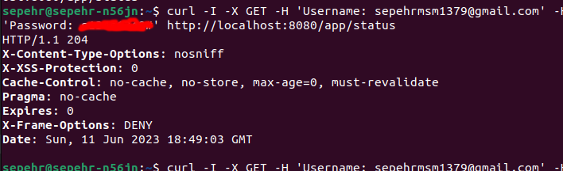

## Authorization Module
A simple project to implement authentication using a one-time password. In this project, the otp code is sent to the user
via email. The whole project consists of three services:

1. authorization-server: that is responsible for managing user authentication
2. otp-sender: which is used to send a one-time code via email
3. resource-server: It stores all the data related to the user and responds to the client. also for authentication it uses the authorization-server service and sends generated JWT to the client

### Overview
1. Getting unauthorized status code
    
2. Sending username and password to get otp code
    
3. Receive otp code
    
4. Send otp code and get JWT as Authorization header
    
5. Send JWT and get the response!
    

### How to use?

1. Install Docker
2. Clone the project
   ```
   git clone https://github.com/Sepehr79/Authentication-OTP.git
   ```
3. Execute the following command:
   ```
   docker-compose up -d
   ```
